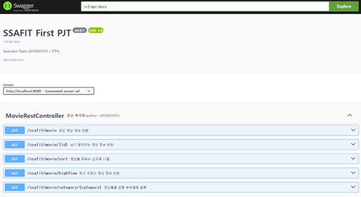
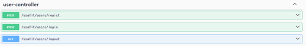
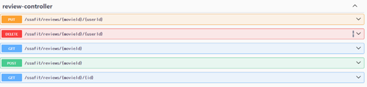
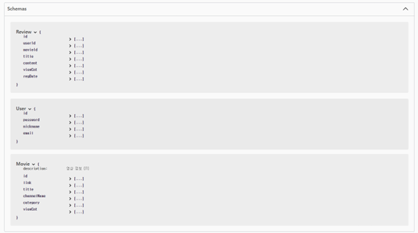
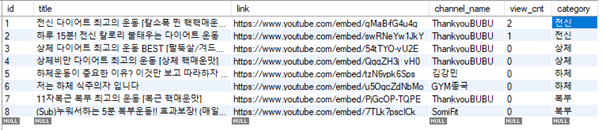
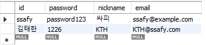
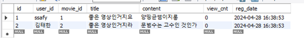

# Ssafit_DB 관통 프로젝트 - 2024 - 04 - 12

## 프로젝트 계획 이유
> - 웹 MVC 아키텍처를 이해하고 이를 활용하여 프로젝트에 적용할 수 있다.
> - Spring Framework를 이해하고 RESTful 방식으로 웹 서버를 구축할 수 있다.
> - DB 연동은 MyBatis Framework를 활용하여 작성할 수 있다.
> - 그동안의 Spring Boot 및 Rest API를 이용해서 데이터를 전송할 수 있다.

---

## 1. 팀원

- 문범수[영상 기능 구현], 김태한[유저, 리뷰 기능 구현]

---

## 2. 사용 Controller

>  ###  관련 기능
>
> 1) 영상 구현 기능 [MovieRestController]
>   * ➢ 모든 영상 정보를 반환하는 기능 구현
> 
>   * ➢ ID가 일치하는 영상 정보를 반환하는 기능 구현
> 
>   * ➢ 영상들을 조회수 순으로 정보를 반환하는 기능 구현
>
>   * ➢ 최고 조회수 영상 정보를 반환하는 기능 구현
> 
>   * ➢ 영상들을 운동 부위별로 분류하고 정보를 반환하는 기능 구현
> 
---
> 
> 2) 유저 정보 구현 기능 [user-controller]
>   * ➢ 사용자 정보를 등록하는 기능 구현
>
>   * ➢ 사용자가 로그인 할 수 있는 기능 구현
>
>   * ➢ 사용자가 로그아웃 할 수 있는 기능 구현
> 
---
>   
> 3) 리뷰 구현 기능 [review-controller]
>   * ➢ 해당 영상의 모든 리뷰 정보들을 반환하는 기능 구현 
> 
>   * ➢ 특정 영상의 특정 사용자의 리뷰 정보를 반환하는 기능 구현
> 
>   * ➢ 리뷰를 등록하는 기능 구현
> 
>   * ➢ 특정 리뷰를 수정하는 기능 구현
> 
>   * ➢ 리뷰를 삭제하는 기능 구현
---

> ## 기능 Summary
> ### 1. 영상 기본 기능 구현
> 

>     
> 

> 
> ---
> 
> ### 2. 유저 정보 기본 기능 구현
> 

>     
> 

>
> ---
> 
> ### 3. 리뷰 정보 기본 및 심화 기능 구현
> 

>     
> 

> 
> ---
> 
> ### 4. 전체 Schema 구조
> 

>     
> 

---

## 3. 기능 구현 및 서비스

> 1) #### 전체적인 구조
> - 각 기능들을 구현할 Controller를 영상, 유저, 리뷰 총 3가지를 구성함   
> 
> - Controller들은 Service Interface를 Singleton 패턴을 사용해 의존성 주입 실시   
> 
> - Service Interface를 상속받은 class는 기능들을 구현하는 method 선언하고, DAO Interface를 똑같이 singleton 패턴으로 의존성을 주입함  
> 
> - DAO Interface는 DB의 정보들을 접근할 수 있는 method 선언  
> 
> - DAO의 method를 구현하기 위한 mapper xml을 만들고, 해당 mapper는 DB에 접근하기 위한 SQL문을 JAVA 객체에 담아 작성함  
> 
> - Spring Boot의 모든 특성은 application.properties에 작성하며, dataSource 및 MyBatis 설정을 수행한다.  
> 
> - 전체적인 구조는 class diagram을 참조
> 
---
> 2) #### 영상 관련 기능
> - ___모든 영상들의 정보를 한꺼번에 불러오는 기능을 구현했고, 이는 페이지를 처음 불러오는 과정에서 사용될 기능으로 예상됨___
> - 특정 영상의 정보를 불러오는 기능은 어느 한 영상을 선택했을 때, 사용할 기능으로 예상
> - 영상들을 조회순으로 나열함으로써 사용자가 원하는 다양한 방식의 정보를 제공
> - 최고 조회수 영상 정보를 불러오는 기능은 차후에 1일, 1주일, 1달간의 최고 조회수 영상 정보를 불러오는 기능으로 고도화 가능할 것으로 예상된
> - 부위별로 영상들을 분류하는 기능을 구현함으로써 사용자가 원하는 부위의 운동영상 정보를 얻을 수 있도록 함
> 

>     
> 

>
---
> 3) #### 유저 정보 관련 기능
> - ___가장 기본이 되는 사용자 회원가입 기능을 구현함___
> - 로그인 및 로그아웃 기능은 interceptor 개념을 사용해 현재 등록되어 있는 아이디와 비밀번호를 비교해 로그인이 가능한지 여부를 판단함
> 

>     
> 

>
---
> 4) #### 리뷰 관련 기능
> - ___기본 기능에 해당하는 리뷰 CRUD 기능을 구현함___
> - 각 영상별로 리뷰가 작성되어야 하기 때문에 참조키와 외래키 설정을 한 DB를 생성함
> - 영상 ID에 대응하는 리뷰들을 불러올 수 있도록 설계했고, 특정 영상을 클릭했을 때 작성된 리뷰 내용들을 불러올 수 있도록 구현함
> 

>     
> 

---

## 4. 겪은 어려움

> - 실제 Vue에서 제대로 작동하는 지 확인 없이 단순 데이터의 전달 및 생성만 확인 가능하다 보니 생각보다 난이도가 높진 않았음
> - ___리뷰 관련해서 각 영상별로 리뷰들을 저장하려 하다 보니 DB 설계과정이 어려웠음___
> - 무결성 원칙과 MySql 문법등과 관련해서 이해도가 많이 부족하다 보니 시간이 오래 걸렸음

---

## 5. 어려움 극복 방법

> - 초반 설계과정을 꼼꼼히 하려 했고, 영상, 리뷰, 유저 정보 총 3가지의 큰 틀을 잡고, 기능 구현에 들어가니 역할 분배 및 시간 효율성이 높았다고 생각함
> - 서로 막히는 부분은 같이 debuging을 하다 보니 시간적으로 절약할 수 있었음
> - DB 설계는 최대한 중복 처리및 비효율적으로 data가 쌓이는 걸 계속 의식적으로 주의하려 했음
> - ___기본 기능 구현에 초점을 두었으며, 향후 Vue 및 최종 프로젝트에 도움이 되기위해 미리 초석이 될 만한 부분들에 대해서 긴밀한 소통을 유지했음___
---

## 6. 이후의 포부
> - DB설계 및 접근 방식에 대해 좀 더 생각해 볼 거리가 많았으며, 리뷰 기능 구현과 관련해서 아직 미흡한 부분이 많기 때문에 그러한 부분을 고쳐나갈 생각입니다.
> - 기본적인 개념 및 문법에 대해서는 시간소모를 줄이고자, 추가적인 학습이 필요해 보입니다.
> - 이전 프로젝트와 달리 각자의 역할을 충분히 수행해주었다는 고무적인 결과를 얻을 수 있는 프로젝트 였다고 생각합니다.
> - 이후 프로젝트에서는 이러한 시너지를 바탕으로 기능 고도화에 초점을 두며 개발에 임할 예정입니다.
---

## 7. 기타 소감

> ### 1. 문범수
> - 기본적인 기능 구현같은 경우에는 복습의 성격이 강한데, 아직까지 사소한 실수가 있는 것을 보고, 기본기를 다지는게 급선무라 생각되었습니다.
> - ___이전에 무작정 따라 쓰는 것과 다르게 전체적인 흐름을 볼 수 있게 되었다는 점은 이번 프로젝트의 성과라 생각되며, pair와의 협업도 좋았다고 생각합니다.___
> - ___향후에 있을 프로젝트에 최대한 도움이 되고자 초반부에 좀 더 꼼꼼히 안정적인 기능 구현에 초점을 두고자 합니다.___
>
> ### 2. 김태한
> - ___범쪽이와 함께라서 힘들었다___
> - ___앞으로의 고난길이 예상된다___
> - 눈에 보이는 화면(프론트) 없이 백엔드만 설계하려다 보니, 파라미터를 어떤 방식으로 받아오는 것인지 결정하기가 어려웠습니다. 
> - ___Spring Boot 방식에 대해 총 정리를 할 수 있던 시간이어서 좋았습니다., 추후 프론트와 종합 시 전달하는 파라미터 등에 관한 설계가 매우 중요할 것으로 생각됩니다.___