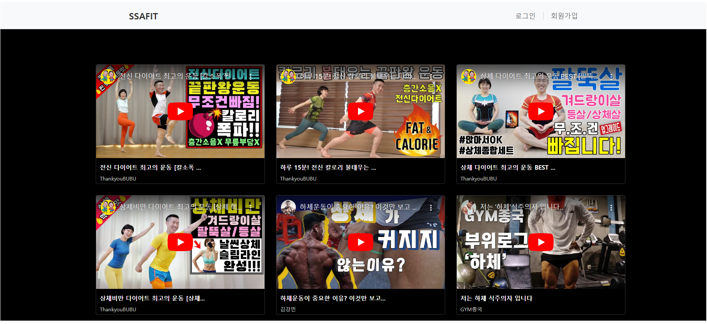
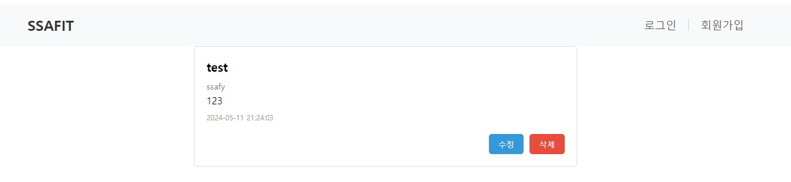
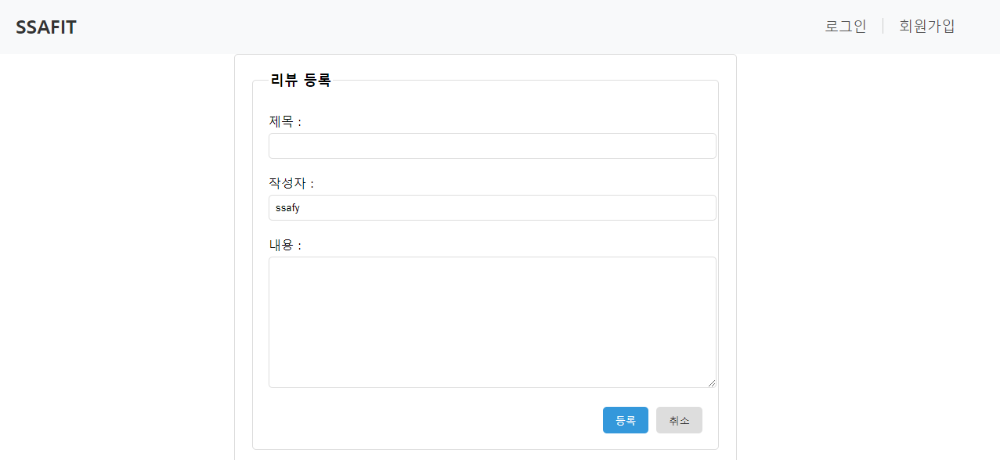
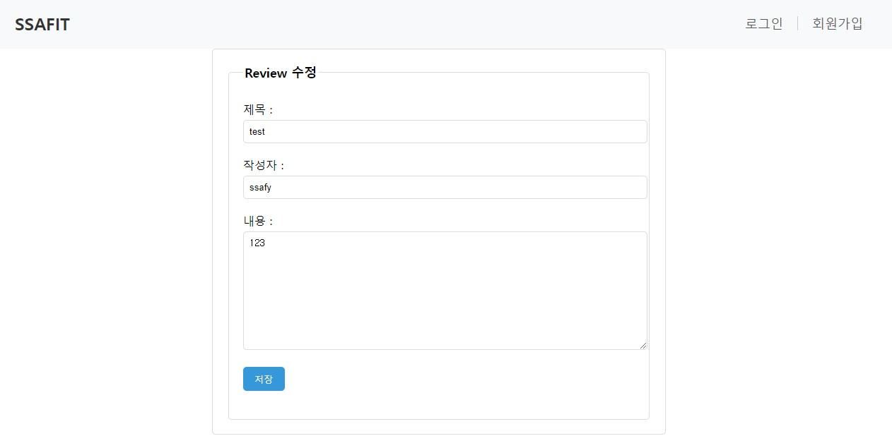

<<<<<<< HEAD
# vue-project

This template should help get you started developing with Vue 3 in Vite.

## Recommended IDE Setup

[VSCode](https://code.visualstudio.com/) + [Volar](https://marketplace.visualstudio.com/items?itemName=Vue.volar) (and disable Vetur).

## Customize configuration

See [Vite Configuration Reference](https://vitejs.dev/config/).

## Project Setup

```sh
npm install
```

### Compile and Hot-Reload for Development

```sh
npm run dev
```

### Compile and Minify for Production

```sh
npm run build
```
=======
# Ssafit_VUE 관통 프로젝트 - 2024 - 05 - 10

## 프로젝트 계획 이유 🎉

> - BackEnd, DB, Front 3가지 기능을 연동하는 완전체 프로그램을 구현할 수 있다.
> - 웹 프론트 아키텍처를 이해하고 이를 활용하여 프로젝트에 적용할 수 있다.
> - 기존 Front-End 부분을 VueFramework을 이용하여 구현한다.
> - Vue의 다양한 라이브러리를 이용하여 SPA방식으로 프로젝트를 구성한다.

---

## 1. 팀원

- 문범수[영상 기능 연동 및 CSS], 김태한[리뷰 기능 연동]

---

## 2. 사용 Controller

> ### 관련 기능
>
> 1) __영상 구현 연동 [MovieList.vue]__
>
>    ➢ 웹에 처음 접속했을 때 나타나는 페이지
>
>    ➢ DB에 저장되어 있는 정보를 Spring boot에서 받아서 활용
>
>    ➢ 유뷰트와 비슷한 형식으로 구성 [다크모드 구현]
>
>    ➢ 해당 영상의 제목 및 채널을 클릭하면 상세 페이지로 이동

---

> 2) __리뷰 정보 기능 연동 [ReviewList.vue / ReviewDetail.vue]__
>    ➢ 특정 영상을 클릭 했을 때 해당영상의 리뷰들을 확인할 수 있는 기능
>
>    ➢ 리뷰에 관련해서 생성, 삭제, 수정, 확인 가능
>
>    ➢ 상단부는 해당 영상과 하단부는 관련 리뷰로 구성

---

> ## 기능 Summary
>
> ### 1. 영상 홈페이지 구성
>
> <div style="text-align:center">
>     
> </div>
>
> ---
>
> ### 2. 특정 영상 상세 페이지 및 관련 리뷰 페이지 구성
>
> <div style="text-align:center">
>     
> </div>
>
> ---
>
> ### 3. 상세 리뷰 페이지 구성
>
> #### 1) 상세 리뷰
>
> <div style="text-align:center">
>   
> <div>
> <br>

> #### 2) 리뷰 등록
>
> <div>
>     
> <div>
> <br>

> #### 3) 리뷰 수정
>
> <div>  
>   
> </div>

---

## 3. 기능 구현 및 서비스

> 1) #### 전체적인 구조

```sh
routes: [
    {
      path: "/movie",
      name: "movie",
      component: MovieView,
    },
    {
      path: "/movie/:movieId",
      name: "review",
      component: ReviewView,
      children: [
        {
          path: "",
          name: "list",
          component: ReviewList,
        },
        {
          path: "review/:reviewId",
          name: "detail",
          component: ReviewDetail,
        },
      ],
    },
    {
      path: "/user",
      name: "user",
      component: UserView,
    },
  ]
```

> - Router는 다음과 같이 부모 자식 관계를 설정함
> - 첫 홈페이지에 대해서는 독립적으로 구성 후 상세 영상 페이지는 Review와 관련된 component를 자식으로 구성함
> - ___향후 활용 기능으로 유저 정보 관련한 router 구조 미리 설계___

---

> 2) #### 영상 관련 연동 기능 구현

```sh
const REST_MOVIE_API = 'http://localhost:8080/ssafit/movie'

export const useMovieStore = defineStore('movie', () => {
  const movieList = ref([])
  const selectedVideo = ref(null)

  const getMovieList = function() {
    axios.get(REST_MOVIE_API)
    .then((response) => {
      movieList.value = response.data
    })
  }

  const clickVideo = function(video){
    selectedVideo.value = video
  }

  return {getMovieList, movieList, clickVideo, selectedVideo};
});
```

<br>

> - ___BackEnd에서 보낸 data를 받기위한 code로 필요한 영상 정보들과 함수, 클릭시 나타날 이벤트 처리 함수, 선택된 영상에 관한 정보를 받는다.___
> - 이전에 설계했던 특정 영상 선택에 관련한 기능을 활요함
> - 여러 영상들을 한꺼번에 나열하기 위해 전체 영상 정보를 받아옴
> - ___이때 사용하는 port의 번호가 다르기 때문에 이를 해결할 수 있는 CORS 기능을 활성화 시켜줘야 한다.___

```sh
	@Override
	public void addCorsMappings(CorsRegistry registry) {
		registry.addMapping("/**").allowedOrigins("*").allowedMethods("GET","POST");
	}
```

---

> 3) #### 리뷰 관련 연동 기능 구현
>
> - ___기본 기능에 해당하는 리뷰 CRUD 기능을 구현함___
> - 페이지가 새로 로드될 때 마다 해당 영상의 정보를 계속 받아올 수 있도록 별도의 함수 구현
> - 업데이트 완료 후 데이터가 남아 있도록 onmounted 설정
> - ___없는 데이터에 접근할 경우 예외 처리 필요___

```sh
<script setup>
import { useMovieStore } from "@/stores/movie"
import { useReviewStore } from "@/stores/review";
import { onMounted } from "vue";
import { useRoute, useRouter } from "vue-router";

const route = useRoute();
const router = useRouter();
const movieId = route.params.movieId
const store = useReviewStore();
const mvstore = useMovieStore();

onMounted(() => {
  mvstore.getMovie(movieId);  
  store.getReviewListById(movieId);
});

const registReview = function() {
  router.push({name: 'registReview'})
}
</script>
```

---

## 4. 겪은 어려움

> - 이전에 구현해 놓은 기능들을 활용하기 위해서 데이터를 받아오고 저장하는 방법이 익숙치 않아 어려움을 겪음
> - 미리 설계해놓은 기능들을 사용하고 싶었지만 기본 기능 구현조차 어려웠기 때문에 시간상 난이도상 쉽지 않았음
> - ___완성시킨 후 통합과정에서 예상치 못한 다양한 디버깅 발견 : 새로고침 문제, 데이터 삭제 문제, 백엔드 코드 문제 등 여러가지 문제 발생함___

---

## 5. 어려움 극복 방법

> - 각자 기존에 작성했던 파트대로 기능을 구현했고, 시간상 무리였던 사용자 관련 기능은 차후로 미뤄두고, 영상과 리뷰 관련한 내용부터 완성시키고자 함
> - 디버깅을 하면서 관련된 내용을 같이 의논하고 적절한 방법이 무엇인지 파악함
> - ___현재까지 어려움이 많기 때문에 지속적으로 극복 중...___

---

## 6. 이후의 포부

> - 최종 프로젝트에서는 사용자 관련 기능이 매우 중요하기 때문에 이와 관련한 내용들에 대해서 숙지가 필요함
> - 하루빨리 Vue에 대한 이해를 높여서 연동에 있어서 어려움이 없도록 해야 함
> - 서버 배포와 관련해서 활용할 수 있는 Git Server에 대한 이해 필수
> - 참고하고자 하는 내용들을 빠르게 탐색할 수 있는 능력 필요
> - 프로젝트 시작 전 figma, 설계 과정을 마무리하고, 개발에 들어갈 예정

---

## 7. 기타 소감

> ### 1. 문범수
>
> - 생각보다 고려사항이 많았고, 단순히 영상들을 나열하는 부분조차 어려움이 많았기 때문에 확실히 이해할 필요가 있음
> - Spring Boot는 필요한 기능들에 대해서 적절한 데이터를 보낼 수 있을 것으로 예상되는데 아직까지 Vue는 그 정도 수준까지 도달하지 못한 것 같아서 빠른 숙지가 필요해 보임
> - ___내 개발파트 뿐만 아니라 파트너의 어려움도 도와줄 필요가 있는데 그 정도의 역량이 안되어서 이부분에 대한 안타까움이 있음___
>
> ### 2. 김태한
>
> - vue의 import 와 비동기 방식을 완전히 이해하지 못 해 에러를 처리하는 데 오랜 시간이 걸려 어려웠다.
> - 존재하지 않는 영상. 리뷰 경로로 접속 시 이전 페이지로 push하는 작업을 추가하면서, 실제 사용자가 페이지를 사용할 때의 로직을 더 생각해볼 수 있었다.
> - ___최종 프로젝트 구현 시, 실제 사용자의 관점에서 고려를 충분히 하는 것이 매우 중요한 것임을 깨달을 수 있었다.___
>>>>>>> 2078337045da9b10a8f2f364d482708bbb0f86ec
